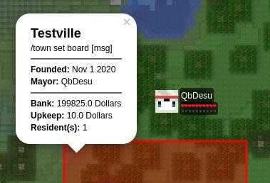

# UP FOR GRABS

This project is unmaintained. Anybody who would like to for it should feel free to do so. I'm likely not gonna update it... ever.

# Dynmap meets Towny

This is a fork and partial rewrite of [Dynmap-Towny](https://github.com/TownyAdvanced/Dynmap-Towny). It is still in beta so there might be some instabilities and things might be subject to change between version. Some features are still missing but it should already provide basic functionality.

